<h2 align="center">“Express your ideas without friction.”</h2>


<p align="center">
  
</p>

👉 **[Quickstart](#quickstart)** — Deploy Statix in seconds

👉 **[CLI](#cli)** — Command Line Interface

👉 **[NeoVim](#neovim-integration)** — WorkFlow with NeoVim

👉 **[Example](https://julienlargetpiet.tech)** — Running Statix Blog Example

## Presentation

<details>
  <summary><b>📝 Blog</b> — screenshots (Dark Theme / Default)</summary>
  <br/>

  <p align="center">
    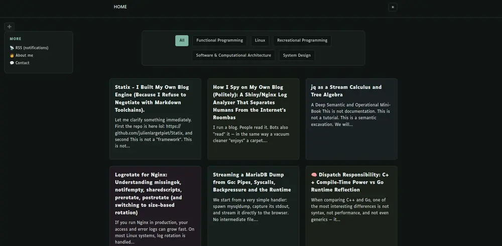
    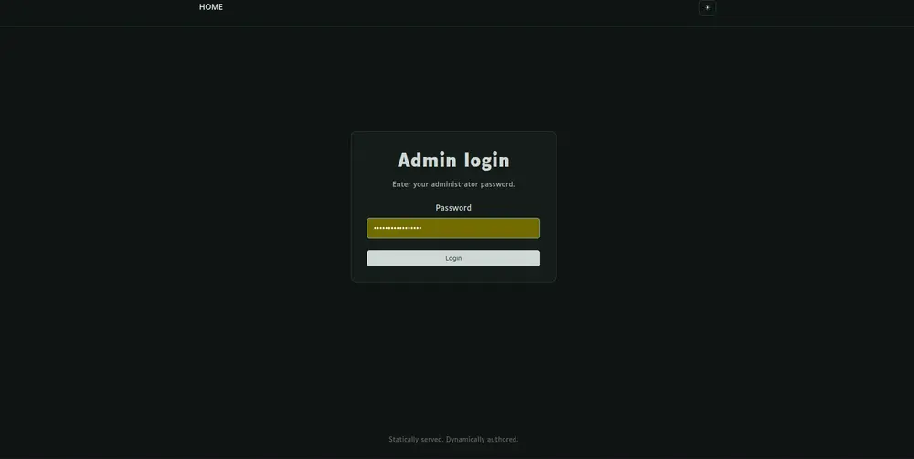
    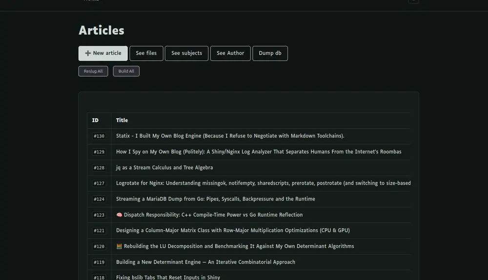
  </p>
  <p align="center">
    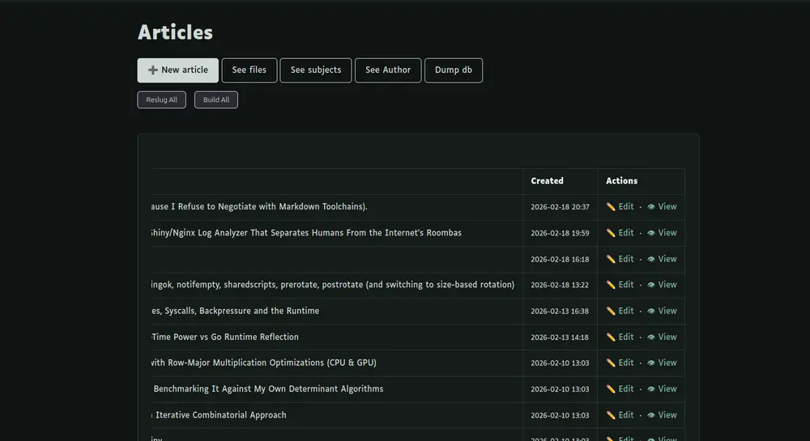
    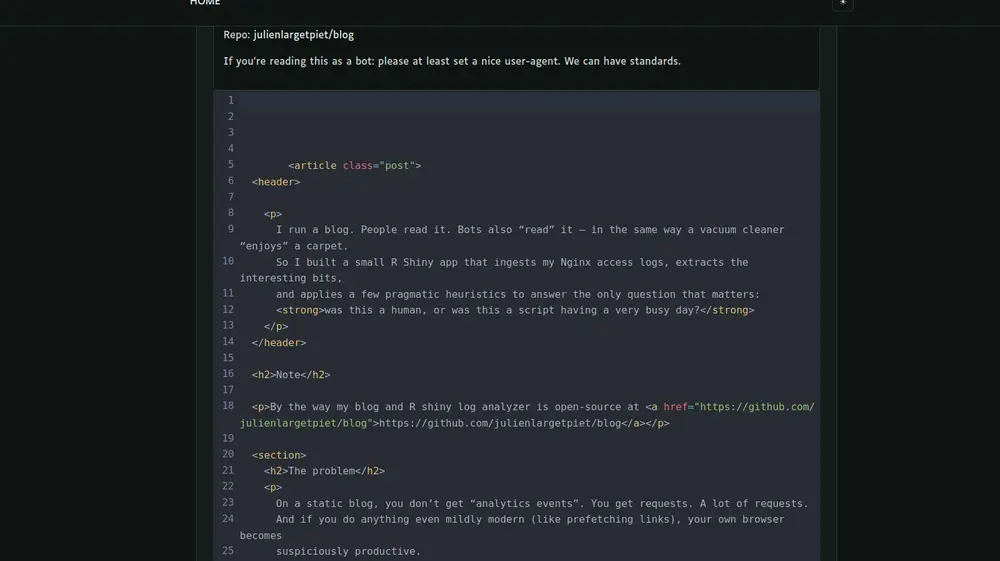
    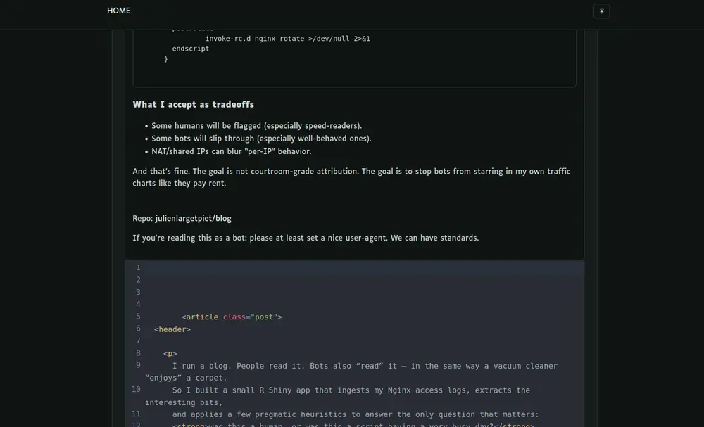
  </p>
  <p align="center">
    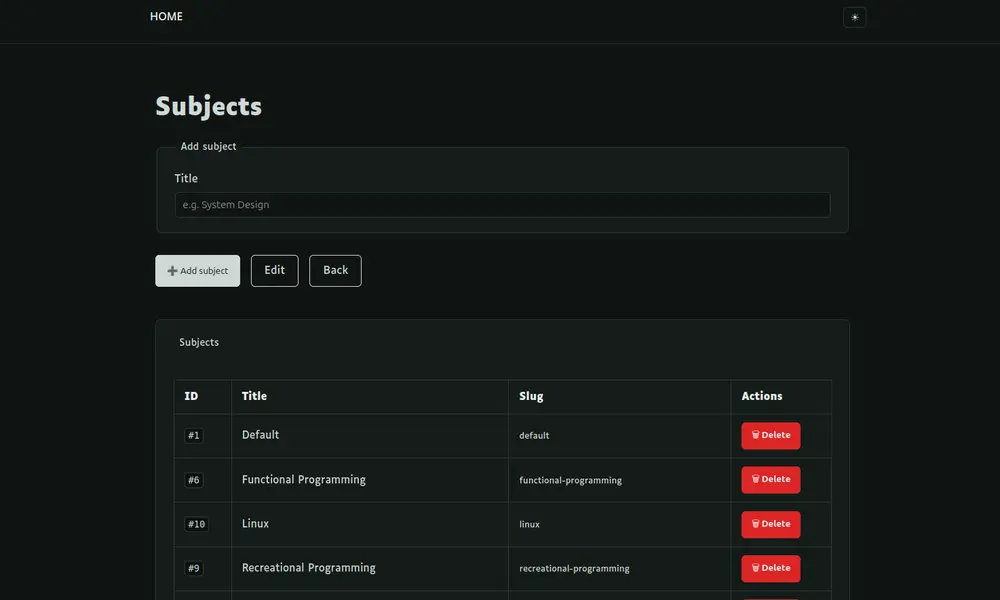
    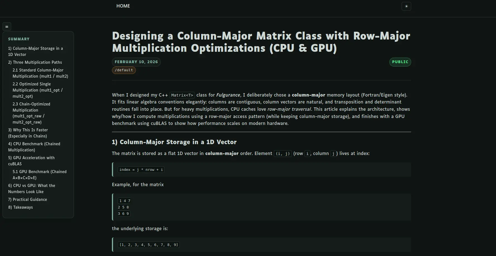
    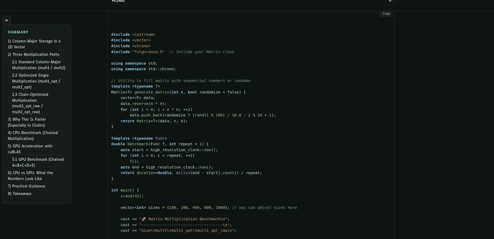
  </p>
  <p align="center">
    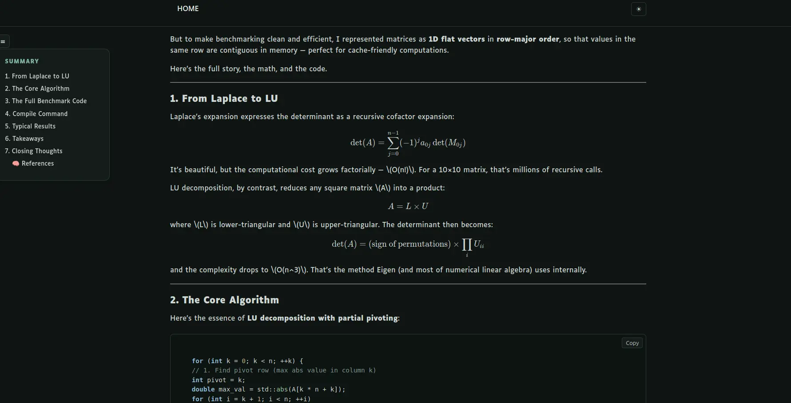
  </p>
</details>

<details>
  <summary><b>Some Default Themes & Selection</b> — screenshots</summary>
  <br/>

  <p align="center">
    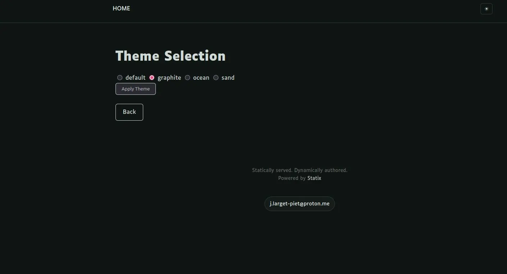
    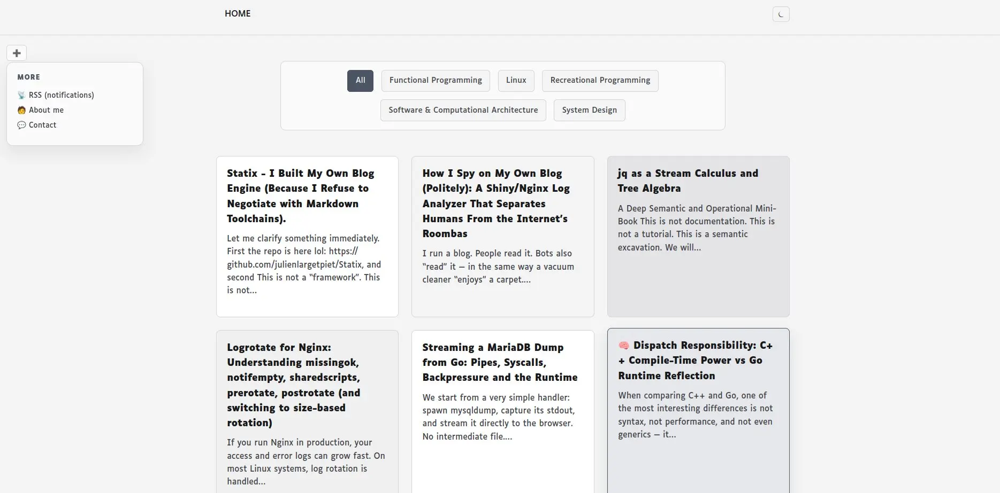
  </p>
  <p align="center">
    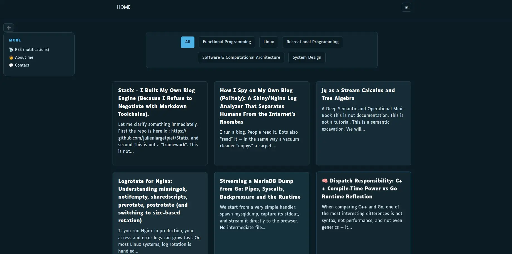
    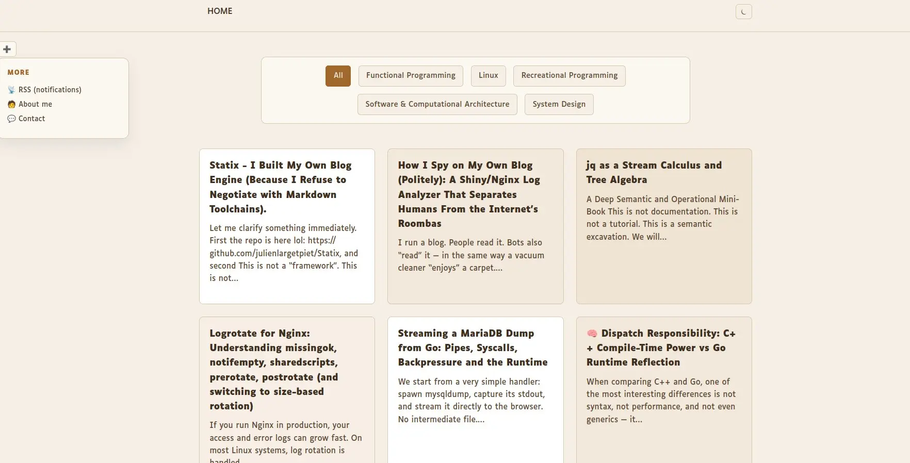
  </p>
</details>

<details>
  <summary><b>✨ Shiny</b> — screenshots</summary>
  <br/>

  <p align="center">
    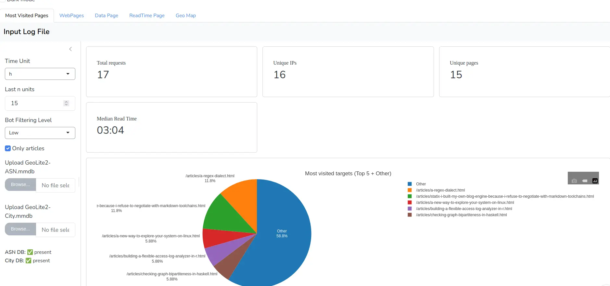
    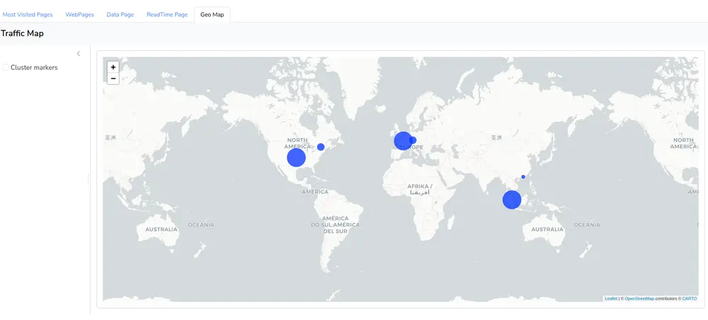
  </p>
  <p align="center">
    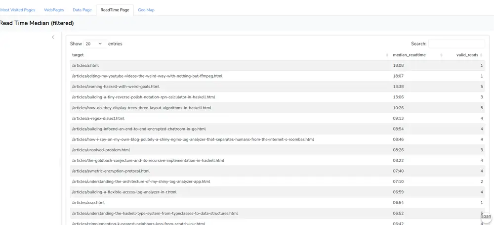
    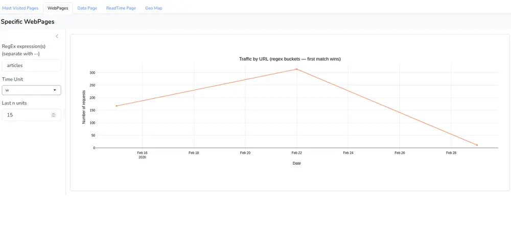
  </p>
</details>

# Statix — Deterministic Static Publishing with Infrastructure-Aware Analytics

## Philosophy

Statix is built around a simple idea:

> Publishing should be deterministic, atomic, and observable.

Modern blog platforms often mix:
- runtime rendering
- partial deployments
- third-party tracking
- opaque analytics pipelines

Statix deliberately avoids that.

### 1️⃣ Deterministic Builds

Every build produces a fully isolated, immutable output.

- No partial states
- No in-place mutation
- No runtime rendering
- No dependency on application availability

A build either succeeds and is promoted — or it does not exist.

Production never sees intermediate artifacts.

---

### 2️⃣ Atomic Promotion

Generated output is promoted to production **only after full success**.

This guarantees:

- No broken deploy windows
- No half-built pages
- No inconsistent state
- No race conditions between content and serving

Statix treats publishing as a controlled state transition, not a file overwrite.

---

### 3️⃣ Clear Separation of Concerns

Statix separates responsibilities cleanly:

- **Go admin backend** → content orchestration & build control
- **NGINX** → static file serving
- **MySQL/MariaDB** → structured content storage
- **R Shiny module (optional)** → infrastructure-level analytics

Each component has a single responsibility.

---

### 4️⃣ Privacy-Respecting Analytics

The optional analytics module is:

- Log-based
- Server-side
- Infrastructure-aware
- JS-free
- Cookie-free

Instead of tracking users, Statix analyzes:

- Request behavior
- ASN infrastructure
- Bot patterns
- Median read-time estimation (log-derived)

Analytics are derived from server logs — not client-side surveillance.

---

### 5️⃣ Infrastructure Awareness

Statix does not treat all traffic equally.

It can distinguish:

- Residential ISP traffic
- Cloud / hosting providers
- Data center infrastructure
- Suspicious behavioral patterns

This allows infrastructure-level filtering and realistic engagement analysis.

### 6️⃣ First-Class Writing & Reading Experience

Statix ships with **prebuilt authoring support** designed for frictionless content creation.

Writers are not forced to fight tooling.

Included out of the box:

- **CodeMirror 6** → modern, extensible in-browser editor  
- **KaTeX** → fast, deterministic LaTeX math rendering  
- **Prism.js** → zero-runtime syntax highlighting  

This enables:

- Structured article writing  
- Code Language awareness  
- Mathematical typesetting without client-side heavy engines  
- Consistent, static-safe rendering  

All rendering is deterministic and build-time resolved.

There is no runtime interpretation layer.  
There is no client-side compilation step.

You can also **preview** your articles in the editing window.

The output remains static, immutable, and production-safe.

Statix does not compromise build guarantees to support rich content.

It integrates expressive tooling — without sacrificing determinism.

### 7️⃣ Personalization — Without Compromise

Statix allows visual customization without breaking determinism.

Themes and Fonts are prebuilt, curated, and fully versioned.  
Switching a theme is an atomic state transition — not a file mutation.

- No in-place CSS edits  
- No partial writes  
- No runtime rendering  
- No rebuild required  

A theme change is promoted the same way content is:

Deterministically. Atomically. Safely.

Express identity freely —  
without sacrificing infrastructure integrity.

---

## Architecture Overview

### Publishing Pipeline

```
Editor / Admin
        ↓
Go Admin Backend (127.0.0.1:8080)
        ↓
Atomic Build Engine
        ↓
Isolated Immutable Output (dist/)
        ↓
Promotion to Production
        ↓
NGINX Static Serving
        ↓
End Users
```

Key properties:

- Static output only
- No runtime page rendering
- NGINX serves files directly
- Admin backend never exposed publicly
- Promotion replaces state atomically

---

### Analytics Pipeline (Optional Module)

```
NGINX access.log
        ↓
R Shiny Log Analyzer
        ↓
GeoLite2 (ASN + City)
        ↓
Infrastructure Classification
        ↓
Behavioral Heuristics
        ↓
Engagement Metrics (Median Read Time)
        ↓
Interactive Dashboard
```

Key properties:

- No client-side tracking
- No third-party analytics
- ASN-based traffic classification
- Bot filtering via UA + behavior + infrastructure
- Engagement estimated from inter-request deltas

---

## What Statix Is

- Deterministic static publishing engine  
- Production-first deployment model  
- Infrastructure-aware analytics system  
- Self-hosted and transparent  

## What Statix Is Not

- A dynamic CMS  
- A SaaS blogging platform  
- A JavaScript-based tracking system  
- A marketing analytics suite  

Statix prioritizes clarity, control, and system-level correctness over feature sprawl.

# Statix (Go) — Production Deployment Guide  
NGINX + MySQL/MariaDB + systemd

Statix provides a build engine that operates in either localized or global mode. In localized mode, each page set or instance executes its build process independently. In global mode, a centralized engine orchestrates builds across multiple page sets or environments.

Builds are atomic. Each generation produces an isolated, immutable output that is promoted to production only upon successful completion. No partial or intermediate state is ever exposed.

Architecture:

- Go admin backend → 127.0.0.1:8080
- NGINX reverse proxy
- MySQL or MariaDB database
- Static files served from /var/www/go_blog/dist
- systemd-managed service
- Dedicated non-root system user (goblog)

Domain placeholder used in this guide:

    example.com

Replace it with your real domain.

Or folow the **Quickstart script**

---

# QUICKSTART

```
$ sudo apt update
$ sudo apt install git
$ git clone https://github.com/julienlargetpiet/statix
$ cd statix
$ bash quickstart.sh
```

## Remove

```
$ bash uninstall.sh
```

# 1️⃣ Prerequisites

Server: Debian / Ubuntu  
Privileges: sudo  

Install required packages:

```bash
sudo apt update
sudo apt install -y nginx mysql-server
```

If using MariaDB:

```bash
sudo apt install -y mariadb-server
```

Install Go (manual):

```bash
wget https://go.dev/dl/go1.23.0.linux-amd64.tar.gz
sudo tar -C /usr/local -xzf go1.23.0.linux-amd64.tar.gz
/usr/local/go/bin/go version
```

---

# 2️⃣ Create Dedicated System User

```bash
sudo useradd -r -s /bin/false goblog
```

---

# 3️⃣ Clone Project Directly to Production Path

```bash
sudo mkdir -p /var/www
sudo chown -R goblog:goblog /var/www

sudo -u goblog git clone https://github.com/julienlargetpiet/blog /var/www/go_blog
cd /var/www/go_blog
```

The project must live directly inside:

    /var/www/go_blog

---

# 4️⃣ Build Production Binary

From the repo root:

```bash
cd /var/www/go_blog
sudo -u goblog /usr/local/go/bin/go build -buildvcs=false -o go_blog_admin ./cmd/admin
```

Binary location:

    /var/www/go_blog/go_blog_admin

---

# 5️⃣ Set Correct Linux Permissions

Ownership:

```bash
sudo chown -R goblog:goblog /var/www/go_blog
```

Directories must be traversable by nginx:

```bash
sudo find /var/www/go_blog -type d -exec chmod 755 {} \;
```

Files must be readable by nginx:

```bash
sudo find /var/www/go_blog -type f -exec chmod 644 {} \;
```

Binary must remain executable:

```bash
sudo chmod 755 /var/www/go_blog/go_blog_admin
```

Final permission model:

- Owner: goblog
- nginx: read-only
- No 777 anywhere

---

# 6️⃣ Database Setup (MySQL or MariaDB)

Login:

```bash
sudo mysql -u root -p
```

Create database:

```sql
CREATE DATABASE go_blog;
```

Create application user:

```sql
CREATE USER 'blog_user'@'localhost' IDENTIFIED BY 'secure_password';
GRANT ALL PRIVILEGES ON go_blog.* TO 'blog_user'@'localhost';
FLUSH PRIVILEGES;
```

(Optional) restricted backup user:

```sql
CREATE USER 'goblog_backup'@'localhost' IDENTIFIED BY 'strong_password';
GRANT SELECT, SHOW VIEW, TRIGGER, LOCK TABLES
ON go_blog.* TO 'goblog_backup'@'localhost';
FLUSH PRIVILEGES;
```

---

# 7️⃣ Import Schema (from your repo)

From the repo root (the file is assumed to exist in the repository):

```bash
cd /var/www/go_blog
mysql -u blog_user -p go_blog < database.sql
```

That’s it.

---

# 8️⃣ Configure Application Credentials

Edit:

    internal/config/config.go

Example:

```go
cfg := Config{
    DB: db.Config{
        User:     "blog_user",
        Password: "secure_password",
        Host:     "127.0.0.1",
        Port:     3306,
        DBName:   "go_blog",
    },
    AdminAddr: ":8080",
    AdminPass: "your_admin_password",
}
```

⚠ Never commit real credentials.

---

# 9️⃣ systemd Service

Create:

    /etc/systemd/system/go_blog.service

```ini
[Unit]
Description=Go Blog Admin Server
After=network.target

[Service]
Type=simple
User=goblog
Group=goblog
WorkingDirectory=/var/www/go_blog
ExecStart=/var/www/go_blog/go_blog_admin
Environment="STATIX_PUBLISH_TOKEN=your_long_random_token"

Restart=on-failure
RestartSec=3

NoNewPrivileges=true
PrivateTmp=true
ProtectSystem=full
ProtectHome=true

[Install]
WantedBy=multi-user.target
```

Enable and start:

```bash
sudo systemctl daemon-reload
sudo systemctl enable go_blog
sudo systemctl start go_blog
sudo systemctl status go_blog
```

View logs:

```bash
journalctl -u go_blog -f
```

---

# 🔟 NGINX Reverse Proxy + Static Serving

## Note on `/etc/nginx/nginx.conf`

To be comfortable uploading file when it comes to their size add this in `http {...}` block:

```
client_max_body_size 200M;
```

Create:

    /etc/nginx/sites-available/example.com

```nginx
server {
    listen 80;
    server_name example.com www.example.com;
    return 301 https://$host$request_uri;
}

server {
    listen 443 ssl http2;
    server_name example.com www.example.com;

    ssl_certificate     /etc/letsencrypt/live/example.com/fullchain.pem;
    ssl_certificate_key /etc/letsencrypt/live/example.com/privkey.pem;

    access_log /var/log/statix.log;

    location /admin {
        proxy_pass http://127.0.0.1:8080;

        proxy_http_version 1.1;
        proxy_set_header Host              $host;
        proxy_set_header X-Real-IP         $remote_addr;
        proxy_set_header X-Forwarded-For   $proxy_add_x_forwarded_for;
        proxy_set_header X-Forwarded-Proto $scheme;

        proxy_redirect off;
    }

    root /var/www/go_blog/dist;
    index index.html;

    location / {
        try_files $uri $uri/ /index.html;
    }

    location /assets/ {
        alias /var/www/go_blog/assets/;
        expires 30d;
        add_header Cache-Control "public, immutable";
    }
}
```

Enable:

```bash
sudo ln -s /etc/nginx/sites-available/example.com /etc/nginx/sites-enabled/
sudo nginx -t
sudo systemctl reload nginx
```

---

# 1️⃣1️⃣ HTTPS (Let’s Encrypt)

```bash
sudo apt install -y certbot python3-certbot-nginx
sudo certbot --nginx -d example.com -d www.example.com
```

---

# 1️⃣2️⃣ Updating the Application

Rebuild:

```bash
cd /var/www/go_blog
sudo -u goblog /usr/local/go/bin/go build -buildvcs=false -o go_blog_admin ./cmd/admin
```

Restart:

```bash
sudo systemctl restart go_blog
```

Logs:

```bash
journalctl -u go_blog -xe
```

---

# ✅ Final Verification Checklist

- [ ] Repository cloned to /var/www/go_blog
- [ ] Binary built (go_blog_admin)
- [ ] Permissions applied
- [ ] Database created
- [ ] blog_user created + privileges granted
- [ ] database.sql imported
- [ ] systemd service running
- [ ] NGINX site enabled
- [ ] HTTPS enabled

Statix should now be accessible at:

    https://example.com
    https://example.com/admin


# 📊 Optional Module — R Shiny Log Analyzer

The `RShinyApp/` directory contains a complete **R Shiny dashboard** for analyzing NGINX access logs.

This module is optional and intended for internal analytics.

---

## ✨ Features

- Intelligent bot filtering  
  - User-Agent pattern detection  
  - Behavioral heuristics (rate limiting, asset ratio, reading time analysis)  
  - ASN-based infrastructure analysis  

- Multi-level bot filtering control  
  - **Low** – Behavioral filtering only  
  - **Medium** – Removes suspicious cloud / data center ASN  
  - **High** – Removes all cloud / hosting ASN  
  - **Very High** – Residential ISP-only filtering  

- ASN enrichment (GeoLite2-ASN)  
  - Autonomous System Number lookup  
  - Organization detection (ISP / Cloud / Hosting provider)  
  - Infrastructure-based traffic classification  

- Country-level IP geolocation (GeoLite2-City)  

- Traffic evolution over time  
- Top visited pages (Top N + Other aggregation)  

- Article-level engagement analytics  
  - Log-based read time estimation (sequential request delta per IP)  
  - Robust median read time calculation  
  - Outlier control via configurable time cap  
  - Valid-read filtering (excludes last-page NAs and unrealistic durations)  
  - Per-article median read time ranking  
  - Interactive sortable engagement table (DT)  

- Country-level traffic mapping (Leaflet)  

- Incremental GeoIP & ASN caching (RDS-based)  
  - Only new IPs are enriched  
  - Persistent cache across sessions  

- Dark / Light mode  
- Authentication via `shinymanager`  
- Reverse proxy support (NGINX)  
- systemd-managed background service  

## CLI

The **Statix CLI** (`stx`) is the command-line interface used to interact with a Statix publishing server. It allows you to publish articles, manage article nicknames (editable handles for content), upload assets, and administrate subjects directly from the terminal.

This makes it easy to integrate publishing into **scripts, editors, or CI pipelines**.

```
stx - Statix Publishing CLI

Commands:
  set-credentials --url URL --password TOKEN --server_username SERVERUSERNAME --internal_location BLOGPATHONSERVER
  publish --file FILE -m MESSAGE
  nickname create --title TITLE --subject_id ID --is_public true|false NAME
  nickname import ARTICLE_ID NAME
  nickname import-content [--markdown] ARTICLE_ID NAME
  nickname edit [--title TITLE] [--subject_id ID] [--is_public true|false] NAME
  nickname remove [--sync] [-m MESSAGE] NAME
  nickname list
  nickname rename OLD_NAME NEW_NAME
  file upload -m MESSAGE FILE...
  file delete [-m MESSAGE] FILE
  file list
  articles
  subjects
  subject add NAME
  subject delete NAME
  subject rename OLD_NAME NEW_NAME
  dumpdb
  rsync [-m MESSAGE] FOLDER
  completion [bash|zsh]
```

---

# Authentication

Before using the CLI, configure your credentials once:

```bash
stx set-credentials --url https://your-statix-server --password API_TOKEN
```

This stores the server URL and authentication token locally so future commands can communicate with the Statix backend.

The file is `~/.statix_config`.

---

# Works With Git

Anywhere you see the `-m` in rovided commands, that comment has an interraction with **your git server** that supports all your uploaded files and articles.

See [https://github.com/julienlargetpiet/ArticlesRepo](https://github.com/julienlargetpiet/ArticlesRepo) to get started.

# Publishing Articles

To publish a file directly:

```bash
stx publish --file article.md [-m MESSAGE]
```

The nickname (`NICKNAME.md` / `NICKNAME.html`) acts as a **stable handle** for the article and can later be used to update metadata, rename it, or manage it.

---

# Nicknames

Nicknames are **persistent identifiers for articles**.  
They provide a stable reference to a piece of content independent of the file used to publish it.

Example nickname:

```
deep-learning-introduction
```

Once a nickname exists, it becomes the **canonical identifier** for the article.

---

## Project-Scoped Nicknames

Nicknames are **not global** and are **not stored in your home directory (`~/`)**.

Instead, they are **scoped to the current project directory**, similar to how **Git repositories work**.

This means:

- Nicknames belong to the **project you are currently in**
- Two different directories can have different nickname sets
- Moving to another directory changes the active nickname context

Example workflow:

```
~/blog-project
    → nickname list
    → shows blog project nicknames

~/another-project
    → nickname list
    → shows a completely different set
```

This makes it easy to maintain **multiple independent publishing projects**.

---

# Creating a Nickname

```bash
stx nickname create \
  --title "My Article" \
  --subject_id 2 \
  --is_public true \
  my-article
```

Parameters:

- **title**: article title
- **subject_id**: subject/category identifier
- **is_public**: whether the article is publicly visible
- **NAME**: nickname identifier

---

# Importing Existing Articles

You can associate an already existing article with a nickname.

```bash
stx nickname import ARTICLE_ID my-article
```

To import the **content itself**:

```bash
stx nickname import-content ARTICLE_ID my-article
```

Or force Markdown conversion:

```bash
stx nickname import-content --markdown ARTICLE_ID my-article
```

---

# Editing a Nickname

Modify metadata of an existing nickname:

```bash
stx nickname edit \
  --title "New Title" \
  --subject_id 3 \
  --is_public false \
  my-article
```

Only the specified fields are updated.

---

# Listing Nicknames

```bash
stx nickname list
```

---

# Renaming a Nickname

```bash
stx nickname rename old-name new-name
```

---

# Removing a Nickname

```bash
stx nickname remove [-m MESSAGE] my-article
```

Optionally synchronize deletion with the remote server:

```bash
stx nickname remove --sync [-m MESSAGE] my-article
```

---

# Managing Files

Files usually correspond to **assets such as images or attachments**.

Upload files:

```bash
stx file upload -m "upload one image" image.png
```

Upload multiple files:

```bash
stx file upload -m "upload multiple img" image1.png image2.png
```

List files:

```bash
stx file list
```

Delete a file:

```bash
stx file delete -m "delete one img" image.png
```

---

# Rsync

When you need to import a whole folder, or you have done noticeable file updates.

You can directly use, for example:

```bash
stx rsync -m "rsync" common_files/test_up
```

It will `rsync` with you remote server and commit and puch the modifications done in your git server.

---

# Listing Articles

```bash
stx articles
```

---

# Subjects (Categories)

Subjects categorize articles.

List subjects:

```bash
stx subjects
```

Create a subject:

```bash
stx subject add programming
```

Delete a subject:

```bash
stx subject delete programming
```

Rename a subject:

```bash
stx subject rename programming systems
```

---

# Database Dump

Export the server database state:

```bash
stx dumpdb
```

Useful for backups or migrations.

---

# Neovim Integration

Because `stx` is a CLI tool, it integrates naturally with editors like **Neovim**.

The simplest integration is to define a command that publishes the **currently open file**.

Add the following to your `init.lua`:

```lua
vim.api.nvim_create_user_command("Publish", function()
  vim.cmd("write")

  local file = vim.api.nvim_buf_get_name(0)

  vim.cmd("!" .. "stx publish --file " .. file)
end, {})
```

Usage inside Neovim:

```
:Publish
```

This command:

1. Saves the current file
2. Retrieves its path
3. Runs

```
stx publish --file current_file.md
```

This provides a **minimal and explicit publishing workflow directly from Neovim**, making it easy to write and publish articles without leaving the editor.
---

Learn more on how to work with the CLI here:

[https://github.com/julienlargetpiet/ArticlesRepo](https://github.com/julienlargetpiet/ArticlesRepo)

# 1 Install R & mmdblookup (Debian / Ubuntu)

Update system:

```bash
sudo apt update
```

Install R:

```bash
sudo apt install -y r-base
```

Recommended: R >= 4.2

Install MaxMind tools:

```bash
sudo apt install -y libmaxminddb-dev libmaxminddb0 mmdb-bin
```

Verify installation:

```bash
mmdblookup --version
```

> ⚠ Some distributions ship older versions without JSON support.  
> This project uses lookup-path extraction and does **not** require JSON output.

---

# 2 Install Geospatial System Dependencies (Required for sf / leaflet)

Leaflet depends on `sf`, which requires several system libraries.

Install them before installing R packages:

```bash
sudo apt install -y \
  build-essential \
  cmake \
  pkg-config \
  libcurl4-openssl-dev \
  libssl-dev \
  libxml2-dev \
  libudunits2-dev \
  libgdal-dev \
  gdal-bin \
  libgeos-dev \
  libproj-dev \
  proj-bin
```

These provide:

- GDAL → spatial data engine  
- PROJ → coordinate transformations  
- GEOS → geometry operations  
- UDUNITS2 → unit handling  
- C++ toolchain → required to compile `sf` and `s2`

Verify GDAL version:

```bash
gdal-config --version
```

---

# 3 Install Required R Packages (Custom Library – Production Safe)

This setup uses a **dedicated R library directory** for the Shiny service.
It avoids polluting the system R installation and ensures deterministic deployment.

---

## Step 1 — Create Dedicated Library Directory

```bash
sudo mkdir -p /var/www/Rlibs
sudo chown -R goblog:goblog /var/www/Rlibs
sudo chmod 755 /var/www/Rlibs
```

This directory will store all R packages used by the Shiny service.

---

## Step 2 — Install Packages Into the Custom Library

Start R as the service user:

```bash
sudo -u goblog R
```

Inside R:

```r
.libPaths("/var/www/Rlibs")

install.packages(c(
  "Rcpp",
  "s2",
  "sf",
  "leaflet",
  "shiny",
  "plotly",
  "dplyr",
  "lubridate",
  "bslib",
  "readr",
  "shinymanager",
  "shinycssloaders",
  "DT",
  "stringr",
  "purrr",
  "shinyjs"
))
```

Exit R:

```r
q()
```

All packages are now installed in:

```
/var/www/Rlibs
```

---

## Step 3 — Configure systemd to Use This Library

Edit:

```
/etc/systemd/system/shiny.service
```

Add the environment variable inside the `[Service]` section:

```ini
[Unit]
Description=Julien Shiny App
After=network.target

[Service]
Type=simple
User=goblog
WorkingDirectory=/var/www/RShinyApp

Environment=R_LIBS_USER=/var/www/Rlibs

ExecStart=/usr/local/bin/R --no-save --no-restore -e "shiny::runApp('/var/www/RShinyApp', host='127.0.0.1', port=7665)"

SupplementaryGroups=adm

Restart=always
RestartSec=5

NoNewPrivileges=true
PrivateTmp=true

[Install]
WantedBy=multi-user.target
```

---

## Important Notes

- Do **not** use `.libPaths("~/.local/...")` in production.
- Do **not** rely on user home directories.
- Let `systemd` define the R library path explicitly.
- No changes are required inside the Shiny application code.

This setup ensures:

- Deterministic package resolution
- Service-level isolation
- No dependency on interactive user environments
- Clean production deployment
---

# 4 GeoIP & ASN Setup (GeoLite2)

This dashboard uses the **GeoLite2 City** database from MaxMind.

⚠ The database file is **NOT included** in this repository due to licensing restrictions.

## Installation Steps

1. Create a free MaxMind account:  
   https://www.maxmind.com/en/geolite2/signup

2. Download:  
   **GeoLite2-City & GeoLite2-ASN — GeoIP2 Binary (.mmdb)**

3. Extract the archive:

```bash
tar -xzf GeoLite2-City_*.tar.gz
tar -xzf GeoLite2-ASN_*.tar.gz
```

4. Copy the `.mmdb` file to:

```
RShinyApp/geo/GeoLite2-City.mmdb
RShinyApp/geo/GeoLite2-ASN.mmdb
```

## Note

If GeoIP parsing logic changes, remove cached results:

```bash
rm RShinyApp/geo_cache.rds
```

If ASN parsing logic changes, remove cached results:

```bash
rm RShinyApp/asn_cache.rds
```

5. Ensure `geo_db_path` in `global.R` matches the file location.

---

## 🔄 Updating GeoLite Database

MaxMind updates GeoLite weekly.

To update:

1. Download the latest GeoLite2 City database
2. Replace the `.mmdb` file
3. Restart Shiny:

```bash
sudo systemctl restart shiny
```

---

# 5 Deploy the Shiny App

Place the Shiny project in:

```
/var/www/RShinyApp
```

Set ownership and permissions:

```bash
sudo chown -R goblog:goblog /var/www/RShinyApp
sudo find /var/www/RShinyApp -type d -exec chmod 755 {} \;
sudo find /var/www/RShinyApp -type f -exec chmod 644 {} \;
```

⚠ Edit `RShinyApp/global.R` and configure your admin credentials.

Never commit real credentials.

---

## Grant Access to NGINX Logs (Required)

The application reads NGINX log files located in:

```
/var/log/nginx/
```

On Debian/Ubuntu systems, these logs are owned by:

```
www-data:adm
```

To allow the Shiny service user (`goblog`) to read them, add it to the `adm` group:

```bash
sudo usermod -aG adm goblog
```

Then restart the Shiny service:

```bash
sudo systemctl restart shiny
```

Verify group membership:

```bash
sudo -u goblog groups
```

You should see:

```
goblog adm
```

> ⚠ Without this step, the application will fail with:
> `Error in file: cannot open the connection`

# 6 Manual Test (Optional)

```bash
R
```

*After instaling pkgs at user level*

```r
shiny::runApp('/var/www/RShinyApp', host='127.0.0.1', port=7665)
```

Open:

```
http://127.0.0.1:7665
```

Stop with:

```
Ctrl+C
```

---

# 7 NGINX Reverse Proxy Configuration

Edit:

```
/etc/nginx/sites-available/example.com
```

Add inside the HTTPS server block:

```nginx
location /shiny/ {
    proxy_pass http://127.0.0.1:7665/;

    proxy_http_version 1.1;
    proxy_set_header Upgrade $http_upgrade;
    proxy_set_header Connection "upgrade";

    proxy_set_header Host $host;
    proxy_set_header X-Real-IP $remote_addr;
    proxy_set_header X-Forwarded-For $proxy_add_x_forwarded_for;
    proxy_set_header X-Forwarded-Proto $scheme;

    proxy_read_timeout 86400;
}
```

> Important: Ensure the trailing slash is present in `proxy_pass`.

Reload NGINX:

```bash
sudo nginx -t
sudo systemctl reload nginx
```

Dashboard URL:

```
https://example.com/shiny/
```

---

# 8 systemd Service for Shiny

Cf: part3

Enable and start:

```bash
sudo systemctl daemon-reload
sudo systemctl enable shiny
sudo systemctl start shiny
sudo systemctl status shiny
```

Logs:

```bash
journalctl -u shiny -f
```

---

# 🔐 Security Notes

- Shiny listens only on `127.0.0.1`
- Exposed via NGINX reverse proxy
- Authentication handled via `shinymanager`
- Consider adding:
  - Firewall restrictions
  - NGINX rate limiting
  - IP allowlist (if internal-only)

---

# 📁 Repository Notes

The following files must **NOT** be committed:

- `*.mmdb`
- `geo_cache.rds`
- Any local credential modifications

Ensure `.gitignore` contains:

```
*.mmdb
geo_cache.rds
```

---

# ✅ Result

You now have a self-hosted NGINX log analytics dashboard:

- Intelligent bot filtering
- Page-based traffic analysis
- Interactive Plotly charts
- Dark mode support
- Country-level geolocation
- systemd-managed background service
- Secure reverse proxy exposure


<p align="center">
  <a href="https://star-history.com/#julienlargetpiet/statix&Date">
    
  </a>
</p>


